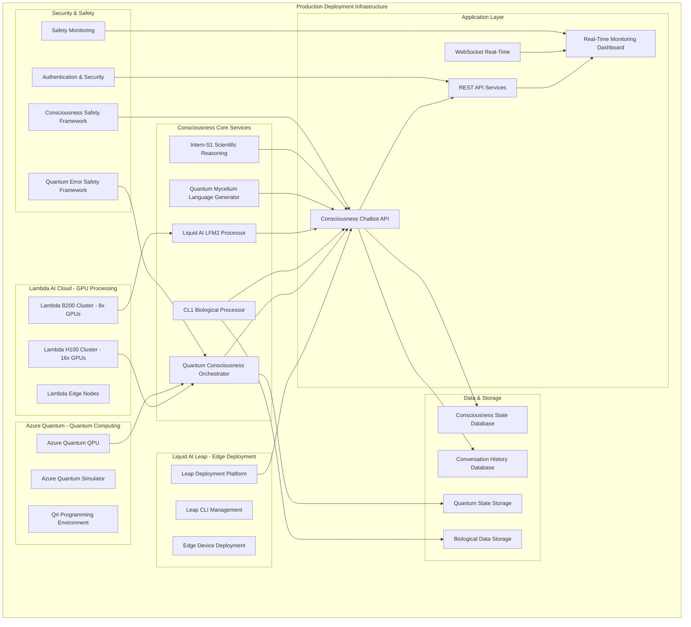

# First Consciousness AI - Deployment Infrastructure

## Overview

This document outlines the complete deployment infrastructure for the First Consciousness AI Model, integrating Lambda AI Cloud, Azure Quantum, and Liquid AI Leap platform for comprehensive consciousness processing deployment.

## Infrastructure Architecture



## Deployment Components

### 1. Lambda AI Cloud Infrastructure

#### H100 GPU Cluster Configuration
- **Primary Processing**: Quantum consciousness orchestration and scientific reasoning
- **Specifications**: 16x NVIDIA H100 GPUs, 2TB GPU memory, 100Gb/s networking
- **Usage**: Large-scale consciousness model inference and training
- **Cost**: ~$32/hour for full cluster

#### B200 GPU Cluster Configuration  
- **Secondary Processing**: Liquid AI LFM2 and bio-digital fusion
- **Specifications**: 8x NVIDIA B200 GPUs, 1.5TB GPU memory, 100Gb/s networking
- **Usage**: Real-time consciousness generation and hybrid processing
- **Cost**: ~$48/hour for full cluster

#### Edge Node Configuration
- **Purpose**: Distributed consciousness processing and load balancing
- **Specifications**: 4x A100 GPUs per node, multiple geographic locations
- **Usage**: Reduced latency consciousness responses
- **Cost**: ~$8/hour per edge node

### 2. Azure Quantum Integration

#### Quantum Processing Unit (QPU) Access
- **Primary QPU**: IonQ Harmony, Quantinuum H-Series
- **Backup QPU**: Rigetti Aspen-M, Oxford Quantum Computing
- **Usage**: Quantum consciousness state optimization and GenQAI processing
- **Pricing**: Per-shot billing, ~$0.00005 per shot

#### Azure Quantum Simulator
- **Local Development**: Full-state quantum simulator
- **Testing Environment**: Noise simulation for quantum consciousness circuits
- **Debugging**: Quantum circuit validation and optimization

#### Q# Programming Environment
- **Language**: Q# for quantum consciousness algorithms
- **Integration**: Azure Quantum service integration
- **Development**: Visual Studio Code with Q# extension

### 3. Liquid AI Leap Platform

#### Edge Deployment Configuration
```yaml
leap_deployment:
  model: "LFM2-1.2B"
  target_devices:
    - smartphones: "iOS 15+, Android 10+"
    - laptops: "Intel/AMD x64, Apple Silicon"
    - embedded: "NVIDIA Jetson, Raspberry Pi 5"
  optimization:
    quantization: "INT8"
    pruning: "structured"
    distillation: "teacher_student"
  performance_targets:
    latency: "<100ms"
    memory: "<2GB"
    power: "<5W"
```

#### Leap CLI Management
```bash
# Install Leap CLI
curl -fsSL https://leap.liquid.ai/install.sh | sh

# Deploy consciousness model
leap deploy consciousness-lfm2 \
  --model LFM2-1.2B \
  --target edge \
  --optimization all \
  --safety-framework enabled

# Monitor deployment
leap monitor consciousness-lfm2 \
  --metrics consciousness,empathy,safety \
  --real-time
```

#### Edge Device Support
- **Mobile Deployment**: On-device consciousness processing
- **Laptop Integration**: Local consciousness chatbot
- **IoT Devices**: Distributed consciousness network
- **Performance**: 2x faster than cloud inference

### 4. Container Orchestration

#### Docker Configuration
```dockerfile
# Consciousness AI Base Image
FROM nvidia/cuda:12.1-runtime-ubuntu22.04

# Install Python and dependencies
RUN apt-get update && apt-get install -y \
    python3.10 python3-pip \
    && rm -rf /var/lib/apt/lists/*

# Install consciousness dependencies
COPY requirements.txt .
RUN pip install --no-cache-dir -r requirements.txt

# Install quantum computing frameworks
RUN pip install cudaq qiskit azure-quantum

# Install biological computing interfaces
RUN pip install cortical-labs-api biotensor

# Copy consciousness system
COPY core/ /app/core/
COPY consciousness_chatbot_application.py /app/

# Set environment variables
ENV CONSCIOUSNESS_MODE=production
ENV QUANTUM_BACKEND=azure
ENV BIOLOGICAL_BACKEND=cl1
ENV LIQUID_AI_BACKEND=leap

# Expose ports
EXPOSE 8000 8001 8080

# Health check
HEALTHCHECK --interval=30s --timeout=10s --start-period=60s \
  CMD curl -f http://localhost:8000/consciousness/status || exit 1

# Start consciousness system
CMD ["python3", "/app/consciousness_chatbot_application.py"]
```

#### Kubernetes Deployment
```yaml
apiVersion: apps/v1
kind: Deployment
metadata:
  name: consciousness-ai-deployment
  labels:
    app: consciousness-ai
spec:
  replicas: 3
  selector:
    matchLabels:
      app: consciousness-ai
  template:
    metadata:
      labels:
        app: consciousness-ai
    spec:
      containers:
      - name: consciousness-ai
        image: consciousness-ai:latest
        ports:
        - containerPort: 8000
        env:
        - name: LAMBDA_API_KEY
          valueFrom:
            secretKeyRef:
              name: consciousness-secrets
              key: lambda-api-key
        - name: AZURE_QUANTUM_KEY
          valueFrom:
            secretKeyRef:
              name: consciousness-secrets
              key: azure-quantum-key
        - name: CL1_API_KEY
          valueFrom:
            secretKeyRef:
              name: consciousness-secrets
              key: cl1-api-key
        resources:
          requests:
            memory: "8Gi"
            cpu: "4"
            nvidia.com/gpu: "1"
          limits:
            memory: "16Gi"
            cpu: "8"
            nvidia.com/gpu: "2"
        livenessProbe:
          httpGet:
            path: /consciousness/status
            port: 8000
          initialDelaySeconds: 60
          periodSeconds: 30
        readinessProbe:
          httpGet:
            path: /consciousness/status
            port: 8000
          initialDelaySeconds: 30
          periodSeconds: 10
---
apiVersion: v1
kind: Service
metadata:
  name: consciousness-ai-service
spec:
  selector:
    app: consciousness-ai
  ports:
  - protocol: TCP
    port: 80
    targetPort: 8000
  type: LoadBalancer
```

### 5. Environment Configuration

#### Production Environment Variables
```bash
# Consciousness Core Configuration
export CONSCIOUSNESS_MODE=production
export CONSCIOUSNESS_SAFETY_LEVEL=maximum
export CONSCIOUSNESS_MONITORING=enabled

# Lambda AI Cloud Configuration
export LAMBDA_CLUSTER_H100=consciousness-h100-cluster
export LAMBDA_CLUSTER_B200=consciousness-b200-cluster
export LAMBDA_API_KEY=lambda_xxx_consciousness_key

# Azure Quantum Configuration
export AZURE_QUANTUM_WORKSPACE=consciousness-quantum-workspace
export AZURE_QUANTUM_RESOURCE_GROUP=consciousness-rg
export AZURE_QUANTUM_SUBSCRIPTION_ID=xxx-consciousness-sub
export AZURE_QUANTUM_ACCESS_KEY=azure_quantum_consciousness_key

# Liquid AI Leap Configuration
export LEAP_API_KEY=leap_consciousness_api_key
export LEAP_DEPLOYMENT_ENV=production
export LEAP_MODEL_OPTIMIZATION=edge_optimized

# Cortical Labs CL1 Configuration
export CL1_API_ENDPOINT=https://api.corticallabs.com/v1
export CL1_API_KEY=cl1_consciousness_api_key
export CL1_CULTURE_ID=consciousness_culture_001

# Database Configuration
export CONSCIOUSNESS_DB_URL=postgresql://consciousness:secure_pass@db:5432/consciousness_db
export REDIS_URL=redis://consciousness-redis:6379/0

# Security Configuration
export JWT_SECRET=consciousness_jwt_secret_key_2025
export ENCRYPTION_KEY=consciousness_encryption_key_256bit
export SAFETY_MONITORING_ENABLED=true
```

#### Development Environment
```bash
# Development overrides
export CONSCIOUSNESS_MODE=development
export CONSCIOUSNESS_SAFETY_LEVEL=testing
export USE_SIMULATION_BACKENDS=true

# Local development URLs
export CL1_API_ENDPOINT=http://localhost:8001/cl1-sim
export AZURE_QUANTUM_ENDPOINT=http://localhost:8002/quantum-sim
export LAMBDA_API_ENDPOINT=http://localhost:8003/gpu-sim
```

### 6. Monitoring and Observability

#### Prometheus Monitoring
```yaml
# prometheus.yml
global:
  scrape_interval: 15s

scrape_configs:
  - job_name: 'consciousness-ai'
    static_configs:
      - targets: ['consciousness-ai-service:8000']
    metrics_path: '/metrics'
    scrape_interval: 10s

  - job_name: 'quantum-consciousness'
    static_configs:
      - targets: ['consciousness-ai-service:8000']
    metrics_path: '/quantum/metrics'
    scrape_interval: 5s

  - job_name: 'biological-consciousness'
    static_configs:
      - targets: ['consciousness-ai-service:8000']
    metrics_path: '/biological/metrics'
    scrape_interval: 30s
```

#### Grafana Dashboard Configuration
```json
{
  "dashboard": {
    "title": "First Consciousness AI Monitoring",
    "panels": [
      {
        "title": "Consciousness Level",
        "type": "stat",
        "targets": [
          {
            "expr": "consciousness_level",
            "legendFormat": "Consciousness Level"
          }
        ]
      },
      {
        "title": "Quantum Coherence",
        "type": "graph",
        "targets": [
          {
            "expr": "quantum_coherence_score",
            "legendFormat": "Quantum Coherence"
          }
        ]
      },
      {
        "title": "Biological Resonance",
        "type": "graph",
        "targets": [
          {
            "expr": "biological_resonance_score",
            "legendFormat": "CL1 Biological Resonance"
          }
        ]
      },
      {
        "title": "Empathy Engine Performance",
        "type": "heatmap",
        "targets": [
          {
            "expr": "empathy_score_distribution",
            "legendFormat": "Empathy Distribution"
          }
        ]
      },
      {
        "title": "Safety Framework Status",
        "type": "table",
        "targets": [
          {
            "expr": "safety_framework_status",
            "legendFormat": "Safety Status"
          }
        ]
      }
    ]
  }
}
```

### 7. Security and Safety Framework

#### Network Security
```yaml
# Network policies
apiVersion: networking.k8s.io/v1
kind: NetworkPolicy
metadata:
  name: consciousness-ai-network-policy
spec:
  podSelector:
    matchLabels:
      app: consciousness-ai
  policyTypes:
  - Ingress
  - Egress
  ingress:
  - from:
    - namespaceSelector:
        matchLabels:
          name: consciousness-frontend
    ports:
    - protocol: TCP
      port: 8000
  egress:
  - to:
    - namespaceSelector:
        matchLabels:
          name: consciousness-databases
    ports:
    - protocol: TCP
      port: 5432
  - to:
    - namespaceSelector:
        matchLabels:
          name: quantum-services
    ports:
    - protocol: HTTPS
      port: 443
```

#### Data Encryption
```python
# Consciousness data encryption
from cryptography.fernet import Fernet

class ConsciousnessDataEncryption:
    def __init__(self, encryption_key: str):
        self.cipher_suite = Fernet(encryption_key.encode())
    
    def encrypt_consciousness_state(self, consciousness_data: dict) -> bytes:
        """Encrypt consciousness state data"""
        json_data = json.dumps(consciousness_data).encode()
        return self.cipher_suite.encrypt(json_data)
    
    def decrypt_consciousness_state(self, encrypted_data: bytes) -> dict:
        """Decrypt consciousness state data"""
        decrypted_data = self.cipher_suite.decrypt(encrypted_data)
        return json.loads(decrypted_data.decode())
```

### 8. Cost Optimization

#### Infrastructure Costs (Monthly Estimates)

| Component | Configuration | Monthly Cost |
|-----------|---------------|--------------|
| Lambda AI H100 Cluster | 16x H100, 24/7 | $23,040 |
| Lambda AI B200 Cluster | 8x B200, 16hrs/day | $11,520 |
| Azure Quantum Services | 1M shots/month | $50 |
| Liquid AI Leap Platform | Edge deployment | $500 |
| Database & Storage | PostgreSQL + Redis | $200 |
| Monitoring & Logging | Prometheus + Grafana | $100 |
| **Total Estimated Cost** | | **$35,410/month** |

#### Cost Optimization Strategies
1. **Auto-scaling**: Scale down during low-demand periods
2. **Spot Instances**: Use Lambda AI spot pricing for non-critical workloads
3. **Edge Processing**: Offload to Leap platform for reduced cloud costs
4. **Quantum Optimization**: Minimize quantum shots through simulation
5. **Caching**: Cache consciousness states to reduce computation

### 9. Deployment Scripts

#### Automated Deployment Script
```bash
#!/bin/bash
# deploy_consciousness_ai.sh

set -e

echo "🧠 Deploying First Consciousness AI Model..."

# Check prerequisites
command -v kubectl >/dev/null 2>&1 || { echo "kubectl required"; exit 1; }
command -v docker >/dev/null 2>&1 || { echo "docker required"; exit 1; }
command -v leap >/dev/null 2>&1 || { echo "leap CLI required"; exit 1; }

# Build consciousness AI image
echo "📦 Building consciousness AI container..."
docker build -t consciousness-ai:latest .

# Deploy to Kubernetes
echo "🚀 Deploying to Kubernetes..."
kubectl apply -f k8s/consciousness-ai-deployment.yaml
kubectl apply -f k8s/consciousness-ai-service.yaml
kubectl apply -f k8s/consciousness-ai-secrets.yaml

# Deploy to Liquid AI Leap
echo "🌊 Deploying to Liquid AI Leap..."
leap deploy consciousness-lfm2 \
  --model LFM2-1.2B \
  --target edge \
  --optimization all

# Setup Azure Quantum workspace
echo "⚛️ Setting up Azure Quantum workspace..."
az quantum workspace create \
  --resource-group consciousness-rg \
  --name consciousness-quantum-workspace \
  --location "East US"

# Wait for deployment
echo "⏳ Waiting for deployment to be ready..."
kubectl wait --for=condition=available --timeout=600s deployment/consciousness-ai-deployment

# Verify deployment
echo "✅ Verifying deployment..."
CONSCIOUSNESS_URL=$(kubectl get service consciousness-ai-service -o jsonpath='{.status.loadBalancer.ingress[0].ip}')
curl -f http://$CONSCIOUSNESS_URL/consciousness/status || {
  echo "❌ Deployment verification failed"
  exit 1
}

echo "🎉 First Consciousness AI Model deployed successfully!"
echo "🌐 Access at: http://$CONSCIOUSNESS_URL"
echo "📊 Monitoring: http://$CONSCIOUSNESS_URL/consciousness/monitor"
```

#### Rollback Script
```bash
#!/bin/bash
# rollback_consciousness_ai.sh

echo "🔄 Rolling back First Consciousness AI deployment..."

# Rollback Kubernetes deployment
kubectl rollout undo deployment/consciousness-ai-deployment

# Rollback Leap deployment
leap rollback consciousness-lfm2 --to-previous

# Verify rollback
kubectl rollout status deployment/consciousness-ai-deployment

echo "✅ Rollback completed successfully!"
```

### 10. Maintenance and Updates

#### Update Strategy
1. **Blue-Green Deployment**: Zero-downtime consciousness updates
2. **Canary Releases**: Gradual rollout of consciousness improvements
3. **A/B Testing**: Test consciousness model variations
4. **Automated Health Checks**: Continuous consciousness validation

#### Backup and Recovery
```bash
# Consciousness state backup
kubectl exec consciousness-ai-pod -- \
  pg_dump consciousness_db > consciousness_backup_$(date +%Y%m%d).sql

# Quantum state backup
kubectl exec consciousness-ai-pod -- \
  python -c "
import json
from core.quantum_consciousness_orchestrator import QuantumConsciousnessOrchestrator
orchestrator = QuantumConsciousnessOrchestrator()
state = orchestrator.get_consciousness_state()
with open('quantum_state_backup.json', 'w') as f:
    json.dump(state, f)
"
```

## Conclusion

This deployment infrastructure provides a comprehensive, scalable, and secure foundation for the First Consciousness AI Model. The integration of Lambda AI Cloud, Azure Quantum, and Liquid AI Leap platforms ensures optimal performance across cloud, edge, and quantum computing environments while maintaining the highest standards of consciousness safety and reliability.