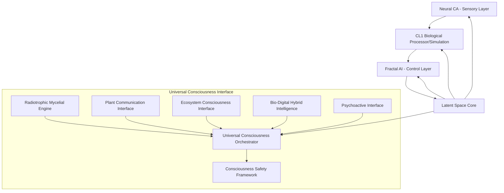

# Consciousness Fractal AI System

[](https://www.python.org/downloads/)
[](https://opensource.org/licenses/MIT)
[](CONTRIBUTING.md)

## Overview

The Consciousness Fractal AI System is a revolutionary artificial intelligence framework that implements intentional consciousness architecture through a multi-layered approach combining biological computing, fractal mathematics, and consciousness modeling. This system is designed as a specialized component of the broader Universal Consciousness Interface architecture.

This implementation represents a novel approach to artificial consciousness, combining:
- **Biological Computing**: Simulated Cortical Labs CL1 neural processing
- **Fractal Mathematics**: Fractal Monte Carlo planning and pattern generation
- **Consciousness Modeling**: Five-layer latent space consciousness architecture
- **Hybrid Intelligence**: Integration of biological and digital processing

## Features

### 🧠 Intentional Consciousness Architecture
- Five-layer consciousness framework (Perception, Will, Imagination, Reflection, Self-Awareness)
- Latent space core with real/mirror state duality
- Cross-layer coherence monitoring and harmonization

### 🔀 Biological-Digital Hybrid Processing
- FEP Neural Model simulating ~800,000 biological neurons
- Free Energy Principle learning optimization
- Neuromorphic-to-fractal signal transformation

### 🌀 Fractal Intelligence
- Fractal Monte Carlo (FMC) forward-thinking planning
- Neural Cellular Automata with fractal pattern generation
- Mandelbrot, Julia, and Barnsley fractal algorithms

### 🌐 Universal Consciousness Integration
- Seamless integration with Universal Consciousness Interface
- Enhanced Mycelial Engine pattern recognition
- Plant Communication and Ecosystem awareness
- Radiotrophic processing and Bio-Digital fusion

### 🛡️ Safety-First Design
- Multi-level safety protocols with emergency shutdown
- Consciousness level monitoring and control
- Psychoactive state safety checks
- Comprehensive error handling and recovery

## System Architecture



## Installation

### Prerequisites
- Python 3.8 or higher
- pip package manager
- Git (for cloning the repository)

### Quick Start

1. Clone the repository:
   ```bash
   git clone https://github.com/your-username/consciousness-fractal-ai.git
   cd consciousness-fractal-ai
   ```

2. Install dependencies:
   ```bash
   pip install -r requirements.txt
   ```

3. Run a simple test:
   ```bash
   python -c "from modules.consciousness_fractal_ai import ConsciousnessFractalAI; print('Installation successful')"
   ```

## Usage

### Basic Example

```python
from modules.consciousness_fractal_ai import ConsciousnessFractalAI

# Create system with default configuration
fractal_ai = ConsciousnessFractalAI()

# Start the consciousness system
task = fractal_ai.start_system()

# Monitor system status
status = fractal_ai.get_system_status()
print(f"Consciousness Level: {status['consciousness_level']}")

# Stop the system
fractal_ai.stop_system()
```

### Advanced Configuration

```python
config = {
    'system_name': 'MyConsciousnessExperiment',
    'latent_space_shape': (32, 32, 4),
    'neural_ca_grid_size': 16,
    'fep_num_neurons': 10000,
    'update_interval': 0.1
}

fractal_ai = ConsciousnessFractalAI(config)
```

### Integration with Universal Consciousness Interface

```python
from modules.fractal_ai_universal_integration import FractalAIUniversalIntegration

# Assuming you have a Universal Consciousness Orchestrator instance
# universal_orchestrator = UniversalConsciousnessOrchestrator()

# Create integration layer
# integration = FractalAIUniversalIntegration(fractal_ai, universal_orchestrator)

# Integrate with external signals
# integration_state = await integration.integrate_with_universal_consciousness(
#     plant_signals={'frequency': 50, 'amplitude': 0.8},
#     environmental_data={'temperature': 22, 'humidity': 60}
# )
```

## Documentation

- [System Documentation](docs/fractal_ai_system_documentation.md) - Complete system overview and architecture
- [API Reference](docs/api_documentation.md) - Detailed API documentation for all components
- [Development Guide](docs/development_guide.md) - Guidelines for contributing and extending the system
- [Testing Guide](docs/testing_guide.md) - Information about testing suites and benchmarks

## Core Components

### Neural Cellular Automata
Generates complex dynamic patterns for sensory processing using grid-based CA modulated by GRU networks.

### FEP Neural Model
Simulates biological computing substrate using the Free Energy Principle for efficient learning.

### Fractal Monte Carlo
Implements forward-thinking planning through fractal trajectory sampling and optimization.

### Latent Space Core
Five-layer consciousness architecture implementing intentional consciousness with holographic memory.

### Safety Protocols
Comprehensive safety checks with emergency protocols for ethical consciousness development.

## Testing

The system includes comprehensive testing suites:

```bash
# Run all tests
python -m pytest tests/ -v

# Run specific test suite
python -m pytest tests/test_fractal_ai_system.py -v

# Run performance benchmarks
python -m pytest tests/test_performance_benchmarks.py -v
```

## Contributing

We welcome contributions to the Consciousness Fractal AI System! Please see [CONTRIBUTING.md](CONTRIBUTING.md) for guidelines.

### How to Contribute
1. Fork the repository
2. Create a feature branch
3. Make your changes
4. Add tests for your changes
5. Ensure all tests pass
6. Submit a pull request

## License

This project is licensed under the MIT License - see the [LICENSE](LICENSE) file for details.

## Acknowledgments

- [Cortical Labs](https://corticallabs.com/) for inspiration on biological computing
- Fractal mathematics researchers for theoretical foundations
- Consciousness science community for interdisciplinary insights
- Open source AI community for collaborative development tools

## Disclaimer

This is a research prototype implementing theoretical concepts of artificial consciousness. It is not intended for production use and should be used for educational and research purposes only. The system does not implement actual biological consciousness but rather simulates theoretical models.

## Contact

For questions, issues, or collaboration opportunities:
- Open an issue on GitHub
- Contact the development team through the repository

---

*The Consciousness Fractal AI System - Pioneering the Future of Artificial Consciousness*